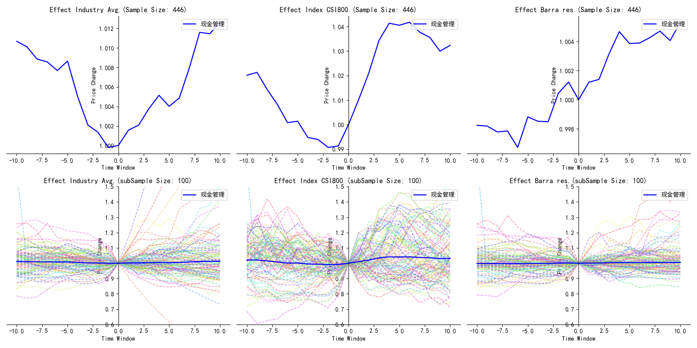
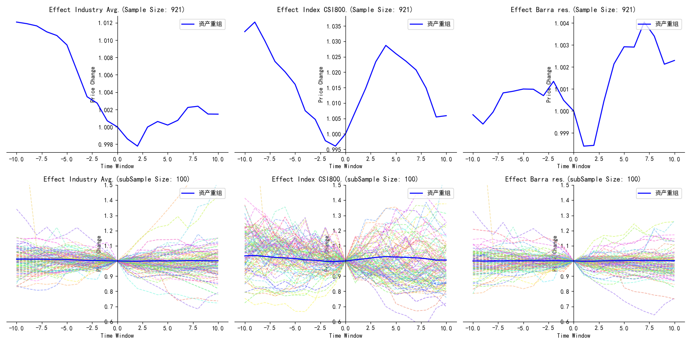
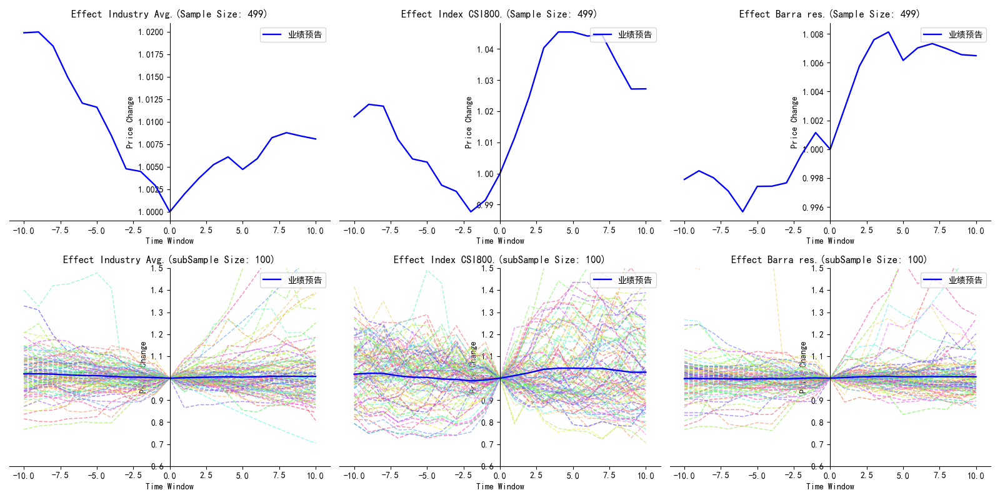
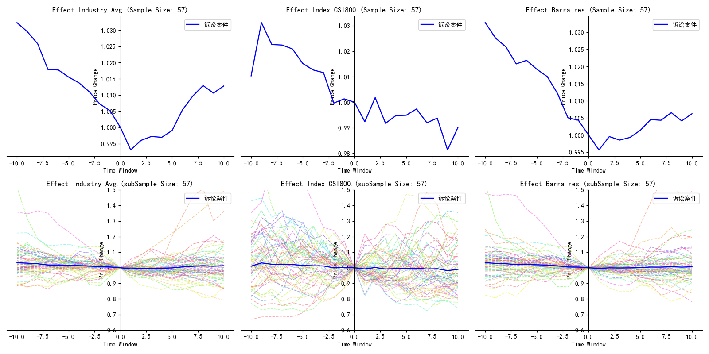
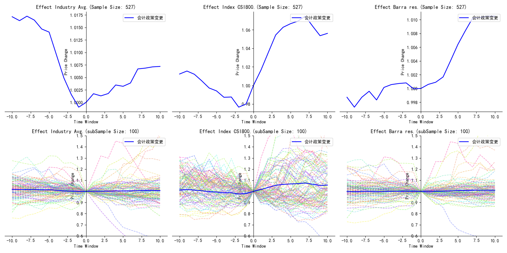
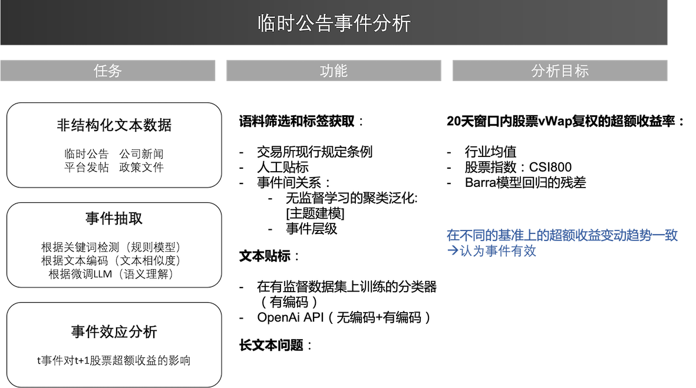
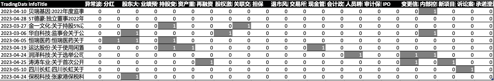
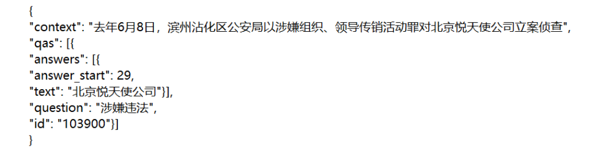

# SignalA_up

[]()


--------------------------------------------------------------------------------

SignalA_up 提供了用于分析上市公司临时公告的模型和函数，包括不同的大语言模型（LLM）、嵌入（embedding）方法、测试模型和辅助工具（如OpenAI API的本地调用）。

您可以在[这里](./开始使用.ipynb)找到使用示例。

## 安装
### 创建虚拟环境（可选）
> 注意：在开始部署前，强烈建议使用 python3.10 或 python3.9 创建虚拟环境，以免干扰原始环境。

要启动或停止虚拟环境，可以使用 conda 命令
```bash
conda create -n your_env_name python=3.10
```
要启动或停用虚拟环境，可以使用：
在 Linux 上
```bash
source activate your_env_nam
# 要停止：
source deactivate
```
在 Windows 上
```bash
source activate your_env_nam
# 要停止：
source deactivate
```
### 构建文档
要使用这些工具，需要安装所需版本的软件包：
```bash
cd proj/
conda install -n your_env_nam requirements.txt # 或 pip install -r requirements.txt
```

## 开始使用
如果已经有数据集，输入文件应该是一个表格，列值的格式与SQL数据库的输出格式匹配:
[[InnerCode]、[SecuCode]、[BulletinDate]、[InsertDate（数据入库的时间）]、[InfoTitle]、[Detail]] ; 如果没有，请参考 [get_word_cloud.py](./get_word_cloud.py) 进行数据抓取。

* 数据格式和数据预处理
  * [如何格式化输入数据并对齐数据使用范围](./proj/mergedata.py)
  * [如何有效爬取股吧特定日期范围的帖子标题及内容（东方财富）及反爬、生成词云等](./get_word_cloud.py)
    * [构造免费ip代理池](./proxy_pool-2.4.1/Proxy_Pool%20代理池项目快速搭建.md)
* 主题模型
  * [如何在数据集上建立主题模型(基于gensim)](main.py)
  * [如何使用不同的文本嵌入方法定制主题模型](./proj/Clustering.py)
* Embedding
  * [如何获取基于全局词频统计的词表征（GloVe）](./GloVe-master)
  * [如何使用 OpenAI 的 LLMs 获取长输入文本的嵌入信息](openai_api_usagecase/embedding_long_inputs.py)
    * [语音识别whisper的本地安装与应用](https://blog.csdn.net/weixin_43401024/article/details/129656610?spm=1001.2014.3001.5502)
    * [金融文件分析助手LlamaIndex](openai_api_usagecase/finDoc_agent.py)
* 标签分类器
  * [示例： 使用 OpenAI api 获取标签（包含可用的Prompts）](openai_api_usagecase/getTAG.py)
  * [构建一个多标签-多输出分类器的最优解](./proj/build_model.py)
* 对 Roberta_chinese 进行微调
  * [如何微调预训练过的分类器（拟合参数）](./proj/Transformer.py)
  * [3 个用于无监督匹配的自定义损失函数](./proj/UnsupervisedLoss.py)
* 结果及分析
  * [如何事件窗口内估计发生某个事件带来的影响--倾向得分匹配(PSM)](./proj/PSM.py)
  * [匹配对象的选取——和行业均值的差、和股指的差以及市值加权的Barra回归残差](./proj/PSM.py)

    
## 示例
<br/>
示例1：LDA训练结果（gensim）

    # LDA0713_临时股东大会前十主题及主题词
    Topic #0: 简易程序 特定 法律 意见书 特定 董事会 办理 对象 发行股票 提请 授权 提请 授权 董事会  授权
    Topic #1: 事务所 律师 法律 意见书 见证 决议 会议 资料 通知 更正
    Topic #2: 法律 集团股份 意见书 律师事务所 取消 部分 事务所 集团股份 法律 议案 会议 资料
    Topic #3: 会议材料 董事会 全权 办理 法律意见书 见证 通知 更正 授权 
    Topic #4: 会议材料 发行上市 法律意见书 本次发行 本次发行上市 会议决议 会议资料 通知 更正 上市决议 法律意见
    Topic #5: 律师事务所 法律意见书 集团股份 集团股份 会议资料 法律意见
    Topic #6: 法律意见书 集团股份 法律意见书 新材料股份有限公司 法律 集团股份
    Topic #7: 大会决议 有效期 法律意见书 提案 补充 通知 增加提案 特定对象
    Topic #8: 类别 会议 股东会 会议材料 h股 法律意见书 会议资料 a股 法律意见
    Topic #9: 律师事务所 会议材料 出版 传媒股份有限公司 法律 意见书 律师事务所 会议资料
               

<br/>
示例2：多标签-多输出Xgboost分类器+穷举搜索最优（GridSearch-Multioutput(XGB(learning_rate=0.1,max_depth=3,min_child_weight:=6,min_samples_leaf=30,reg_alpha=0.1))

    Best score on test set:0.552
    Best beta on test set:1.0
    Best parameters set:   
          learning_rate: 0.1
          max_depth: 3
          min_child_weight: 6
          min_samples_leaf: 30
          reg_alpha: 0.1
    
    ---------------------分红---------------------------------------------
                precision    recall  f1-score   support
             0       0.99      1.00      0.99       949
             1       0.97      0.69      0.81        42
    
      accuracy                           0.99       991
     macro avg       0.98      0.84      0.90       991
    weighted avg       0.99      0.99      0.98       991

    
    ……
    
    ---------------------诉讼案件---------------------------------------------
                  precision    recall  f1-score   support
               0       0.99      1.00      1.00       978
               1       1.00      0.38      0.56        13
        accuracy                           0.99       991
       macro avg       1.00      0.69      0.78       991
    weighted avg       0.99      0.99      0.99       991
    
    The F1 Micro Score is: 0.59
    The F1 Macro Score (Unweighted average) is: 0.56
    The F1_Beta Score is:  0.56
    ROC AUC 分红: 0.8447
    ROC AUC 股东大会决议: 0.8035
    ……
    ROC AUC 诉讼案件: 0.6923

<br/>
示例3：三种匹配对象的PSM结果对比
<br/>
<center>



                      precision    recall  f1-score   support
        
                   0       0.93      1.00      0.96       894
                   1       0.92      0.36      0.52        97
        
            accuracy                           0.93       991
           macro avg       0.93      0.68      0.74       991
        weighted avg       0.93      0.93      0.92       991

现金管理
<br/>
<br/>
<br/>
<br/>


                      precision    recall  f1-score   support
        
                   0       0.87      0.97      0.92       790
                   1       0.78      0.42      0.54       201
        
            accuracy                           0.86       991
           macro avg       0.82      0.69      0.73       991
        weighted avg       0.85      0.86      0.84       991

资产重组
<br/>
<br/>
<br/>
<br/>


                      precision    recall  f1-score   support
        
                   0       0.93      0.99      0.96       883
                   1       0.85      0.44      0.58       108
        
            accuracy                           0.93       991
           macro avg       0.89      0.71      0.77       991
        weighted avg       0.93      0.93      0.92       991

业绩预告
<br/>
<br/>
<br/>
<br/>


                      precision    recall  f1-score   support
        
                   0       0.99      1.00      1.00       978
                   1       1.00      0.38      0.56        13
        
            accuracy                           0.99       991
           macro avg       1.00      0.69      0.78       991
        weighted avg       0.99      0.99      0.99       991
诉讼案件
<br/>
<br/>
<br/>
<br/>


                      precision    recall  f1-score   support
        
                   0       0.92      0.99      0.96       893
                   1       0.74      0.23      0.36        98
        
            accuracy                           0.92       991
           macro avg       0.83      0.61      0.66       991
        weighted avg       0.90      0.92      0.90       991
会计政策变更
</center>

[//]: # (# gensim 词嵌入方法，和transformer的不同)

[//]: # (# 长文本的处理方法 https://zhuanlan.zhihu.com/p/504204038 maxpool)

[//]: # (averaging &#40;weighted by the size of each chunk&#41;)

## 补充信息
1. 数据：2023年上半年公司临时公告（以交易所发布为主） JYDB（当天或一天内更新）
   - 举例：**"募集资金永久改道补充流动资金"**：公司终止募集项目，资金不受监管约束->利空事件 （38/5000）
<br/>
<br/>
2. [《江化微:江阴江化微电子材料股份有限公司关于使用部分闲置募集资金进行现金管理到期赎回的公告》](./603078_20230324_IC35.pdf)
<br/>
<br/>
4. 逻辑
    <center>
    
    </center>
<br/>
<br/>
4. 事件标签：（人工打标 200+官方文件）24->15

<center>
<div>
    <table align="center">
        <thead>
          <tr>
            <th><b>临时公告事件</b></th>
            <th><b>临时公告事件</b></th>
            <th><b>临时公告事件</b></th>
          </tr>
        </thead>
        <tbody>
          <tr>
            <td>分红</td>
            <td>股东大会决议</td>
            <td>资产重组</td>
          </tr>
          <tr>
            <td>业绩预告</td>
            <td>持股变动</td>
            <td>再融资</td>
          </tr>
          <tr>
            <td>业绩预告</td>
            <td>交易所公开信息</td>
            <td>再融资</td> 
          </tr>
          <tr>
            <td>股权激励</td>
            <td>关联交易</td>
            <td>担保</td> 
          </tr>
          <tr>
            <td>退市风险</td>
            <td>新项目开展</td>
            <td>现金管理</td> 
          </tr>
          <tr>
            <td>会计政策变更</td>
            <td>人员聘请</td>
            <td>审计保留意见</td> 
          </tr>
          <tr>
            <td>IPO</td>
            <td>变更信息</td>
            <td>内部控制</td> 
          </tr>
          <tr>
            <td>会计政策变更</td>
            <td>人员聘请</td>
            <td>审计保留意见</td> 
          </tr>
        </tbody>
    </table>
</div>
</center>

<br/>
<br/>

5. 样本数据格式：

<br/>
<br/>

## 后续要做
1. 数据源的扩充
   - 稀疏的临时公告--> 加入公司新闻+行业新闻+股吧文本
   - 示例：
   - 
   - 添加白噪声
   

2. 标签的细化
   - 事件层级
   - 事件分析：
     - NER 加入对事件主体解析（已实现）
     - CCKS事件要素抽取比赛
     - 放弃多标签，对每个时间进行机器阅读理解(Machine reading comprehension MRC）
     - 
   - [《上市公司日常信息披露工作备忘录第一号 临时公告格式指引》](https://law.esnai.com/mview/153290) 上交所 2015

3. NLP技术
   - 文本相似度
   - 专门的语料+**停词（根据训练数据循环生产）**
3. 大语言模型对于上下文的理解（慢，确定有效性后进行）
   - Roberta_chinese
   - 哈工大讯飞联合实验室发布的 Bert-wwm-ext 和 Roberta-wwm-ext


4. 大语言模型+后处理（[规则模型](./proj/rule_models.py)）